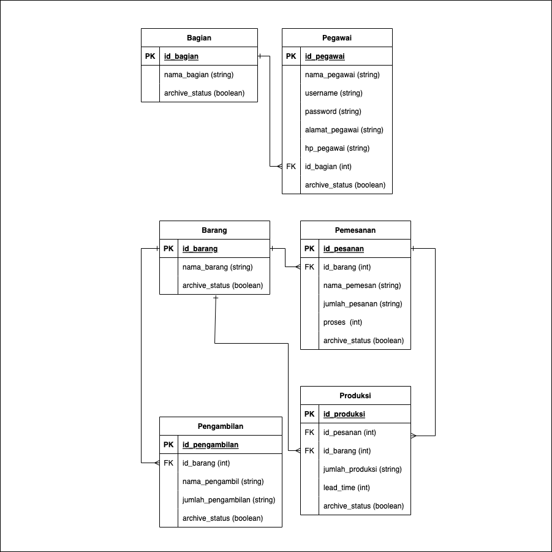

# Video : Pembahasan Web Aplikasi
 
- Code
  - Migration
  - Seeder
  - Routes
  - MVC 
  - Middleware 
- Obstacle 
  - Mismatch data foreign key in INSERT Query.
  - PHP Native to Framework Laravel.  
    By default table in laravel use plural and primary key is `id`. We need to customize.
  - Hard to understand navigation web in UI PHP Native for each role.
  - Chartist.js package for chart bullwhimp are outdated.
  - Using hard delete for deleting main table.
- Adjustment 
  - Implement relation in migration.
  - Implement seeder with json file.
  - Implement eager loading with relation in model.
  - Implement soft delete.
  - Implement session.
  - Implement error message.
  - Implement view code with partial part element (component).


# How to Run ? 

- Prerequisite
  - Composer
  - Larvel 9
  - MySQL with database TK4

- Command Line

```bash
$ composer install 
$ php artisan migrate:reset
$ php artisan migrate:fresh --seed
$ php artisan serve 
```

> !! If not running migration via php artisan, check file `setup.sql` and run query manually.
> setup.sql include DDL for create table and DML for insert data.

Open browser and try some roles from 'id_bagian' by login with these accounts :
```
Username : admin123
Password : admin 

Username : manajer123
Password : manajer

Username : gudang123
Password : gudang

Username : pesanan123
Password : pesanan

Username : produksi123
Password : produksi
```

Available Endpoints : 

- GET /
- GET /login
- POST /login
- GET /logout

- GET /admin/bagian
- GET /admin/bagian/create
- POST /admin/bagian/create
- GET /admin/bagian/update/{id}
- POST /admin/bagian/update/{id}
- GET /admin/bagian/delete/{id}

- GET /admin/pegawai
- GET /admin/pegawai/create
- POST /admin/pegawai/create
- GET /admin/pegawai/update/{id}
- POST /admin/pegawai/update/{id}
- GET /admin/pegawai/delete/{id}

- GET /admin/barang
- GET /admin/barang/create
- POST /admin/barang/create
- GET /admin/barang/update/{id}
- POST /admin/barang/update/{id}
- GET /admin/barang/delete/{id}

- GET /pemesanan
- GET /produksi
- GET /produksi/update/{id}
- GET /gudang
- GET /gudang/pengambilan
- GET /bullwhip
- GET /bullwhip/graphic



---

<p align="center"><a href="https://laravel.com" target="_blank"></a></p>

<p align="center">
<a href="https://github.com/laravel/framework/actions"></a>
<a href="https://packagist.org/packages/laravel/framework"></a>
<a href="https://packagist.org/packages/laravel/framework"></a>
<a href="https://packagist.org/packages/laravel/framework"></a>
</p>

## About Laravel

Laravel is a web application framework with expressive, elegant syntax. We believe development must be an enjoyable and creative experience to be truly fulfilling. Laravel takes the pain out of development by easing common tasks used in many web projects, such as:

- [Simple, fast routing engine](https://laravel.com/docs/routing).
- [Powerful dependency injection container](https://laravel.com/docs/container).
- Multiple back-ends for [session](https://laravel.com/docs/session) and [cache](https://laravel.com/docs/cache) storage.
- Expressive, intuitive [database ORM](https://laravel.com/docs/eloquent).
- Database agnostic [schema migrations](https://laravel.com/docs/migrations).
- [Robust background job processing](https://laravel.com/docs/queues).
- [Real-time event broadcasting](https://laravel.com/docs/broadcasting).

Laravel is accessible, powerful, and provides tools required for large, robust applications.

## Learning Laravel

Laravel has the most extensive and thorough [documentation](https://laravel.com/docs) and video tutorial library of all modern web application frameworks, making it a breeze to get started with the framework.

You may also try the [Laravel Bootcamp](https://bootcamp.laravel.com), where you will be guided through building a modern Laravel application from scratch.

If you don't feel like reading, [Laracasts](https://laracasts.com) can help. Laracasts contains over 2000 video tutorials on a range of topics including Laravel, modern PHP, unit testing, and JavaScript. Boost your skills by digging into our comprehensive video library.

## Laravel Sponsors

We would like to extend our thanks to the following sponsors for funding Laravel development. If you are interested in becoming a sponsor, please visit the Laravel [Patreon page](https://patreon.com/taylorotwell).

### Premium Partners

- **[Vehikl](https://vehikl.com/)**
- **[Tighten Co.](https://tighten.co)**
- **[Kirschbaum Development Group](https://kirschbaumdevelopment.com)**
- **[64 Robots](https://64robots.com)**
- **[Cubet Techno Labs](https://cubettech.com)**
- **[Cyber-Duck](https://cyber-duck.co.uk)**
- **[Many](https://www.many.co.uk)**
- **[Webdock, Fast VPS Hosting](https://www.webdock.io/en)**
- **[DevSquad](https://devsquad.com)**
- **[Curotec](https://www.curotec.com/services/technologies/laravel/)**
- **[OP.GG](https://op.gg)**
- **[WebReinvent](https://webreinvent.com/?utm_source=laravel&utm_medium=github&utm_campaign=patreon-sponsors)**
- **[Lendio](https://lendio.com)**

## Contributing

Thank you for considering contributing to the Laravel framework! The contribution guide can be found in the [Laravel documentation](https://laravel.com/docs/contributions).

## Code of Conduct

In order to ensure that the Laravel community is welcoming to all, please review and abide by the [Code of Conduct](https://laravel.com/docs/contributions#code-of-conduct).

## Security Vulnerabilities

If you discover a security vulnerability within Laravel, please send an e-mail to Taylor Otwell via [taylor@laravel.com](mailto:taylor@laravel.com). All security vulnerabilities will be promptly addressed.

## License

The Laravel framework is open-sourced software licensed under the [MIT license](https://opensource.org/licenses/MIT).
